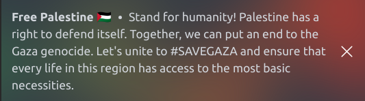
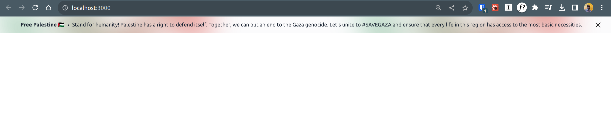

[](https://github.com/Safouene1/support-palestine-banner)

# Support Palestine

This repository contains Website banners , ReadMe Banners and Github Badges that can be used by OSS projects to spread the word, support and help Palestine in this disastrous situation.

## Badge Banner

[](https://github.com/Safouene1/support-palestine-banner)

```md
[](https://github.com/Safouene1/support-palestine-banner)
```

## ReadMe Banner

[](https://github.com/Safouene1/support-palestine-banner)

```md
[](https://github.com/Safouene1/support-palestine-banner)
```

## ReadMe Banner for Projects


```md
[](https://github.com/Safouene1/support-palestine-banner)
```
# Banner Components for React and NextJs 13 with Tailwind

## Sample of mobile with dark mode



## Sample of desktop with light mode



These components out of the box supports

|     | Features                    |
| --- | --------------------------- |
| ✅  | JavaScript                  |
| ✅  | TypeScript                  |
| ✅  | Server Components           |
| ✅  | Responsive                  |
| ✅  | Closeable                   |
| ✅  | Position Sticky or Relative |

If you are not using tailwind [import this css file](React-Components/banner.css)

Components  can be found [here](https://github.com/Safouene1/support-palestine-banner/tree/master/React-Components)

## Banner for websites to show support for Palestine

Use this snippet to show your support for Palestinians on the top of your website. Installing it takes minutes.


## About the Website Banner

This code adds a small black banner on top of your website with Palestinian flag and support message. It links to islamic-relief's donation site but you can change the link to point to a support channel of your choice.


## Installation Banner

Installation is dead simple. Just copy this code to your template right after the opening `<body>` tag.

```html
<style>
  body {
    margin-top: 35px;
  }
  .support-palestine,
  .support-palestine:visited {
    position: absolute;
    left: 0;
    top: 0;
    right: 0;
    background: rgb(0, 0, 0);
    display: flex;
    justify-content: center;
    padding-top: 5px;
    padding-bottom: 5px;
    z-index: 10000;
    text-decoration: none;
    font-family: arial;
  }
  .support-palestine:hover,
  .support-palestine:active {
    background: black;
    display: flex;
    background: rgb(80, 80, 80);
    text-decoration: none;
  }
  .support-palestine__flag {
    margin-right: 10px;
  }

  .support-palestine__label {
    color: white;
    font-size: 12px;
    line-height: 24px;
  }
  .background {
    background: darkgreen;

    height: 21px;
  }
  .top {
    background: black;
    width: 40px;
    height: 8px;
    z-index: 1;
  }
  .middle {
    background: white;
    width: 100%;
    height: 8px;
    z-index: 1;
  }
  .triangle {
    background: auto;
    border-top: 12px solid transparent;
    border-bottom: 12px solid transparent;
    border-left: 20px solid red;
    z-index: 2;
    position: relative;
    top: -16px;
    left: 0;
  }
</style>
<a
  class="support-palestine"
  href="https://www.islamic-relief.org.uk/giving/appeals/palestine/"
  target="_blank"
  rel="nofollow noopener"
  title="Donate to support palestine"
>
  <div
    class="support-palestine__flag"
    role="img"
    aria-label="Flag of palestine"
  >
    <div class="background">
      <div class="top"></div>
      <div class="middle"></div>
      <div class="triangle"></div>
    </div>
  </div>
  <div class="support-palestine__label">Donate to support Palestine</div>
</a>
```

### Used by

- [LGU timetable](https://www.lgutimetable.live/)
